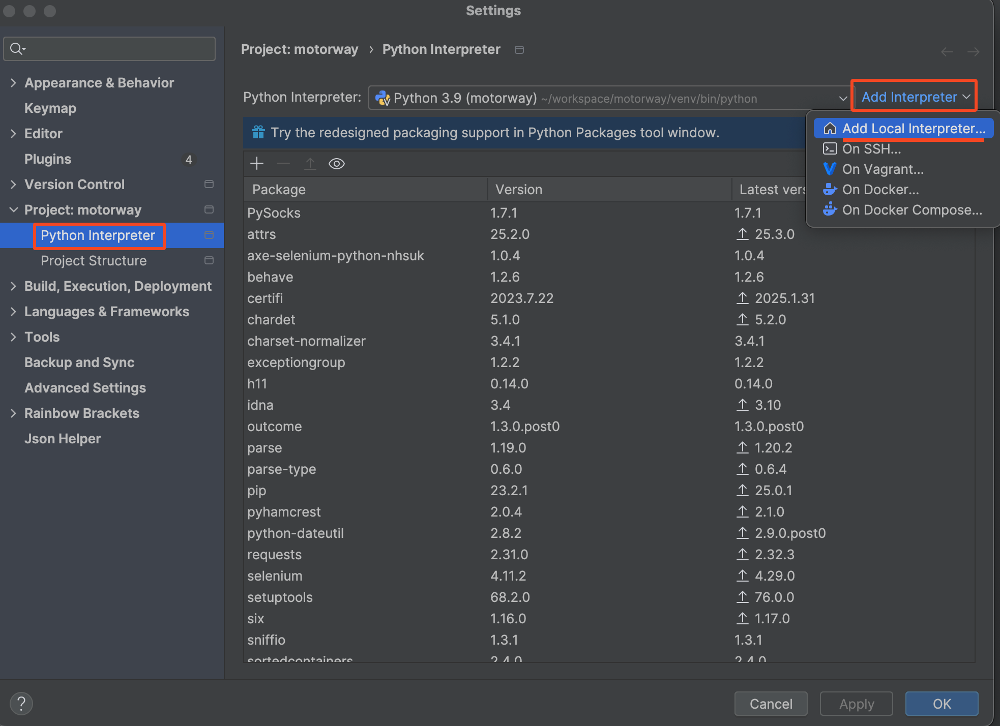
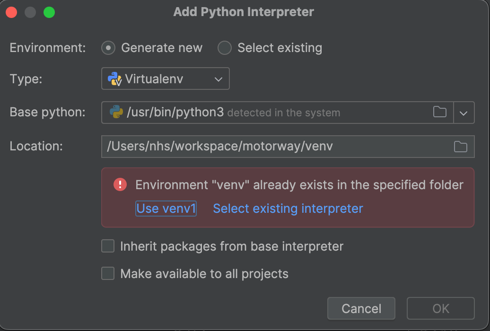
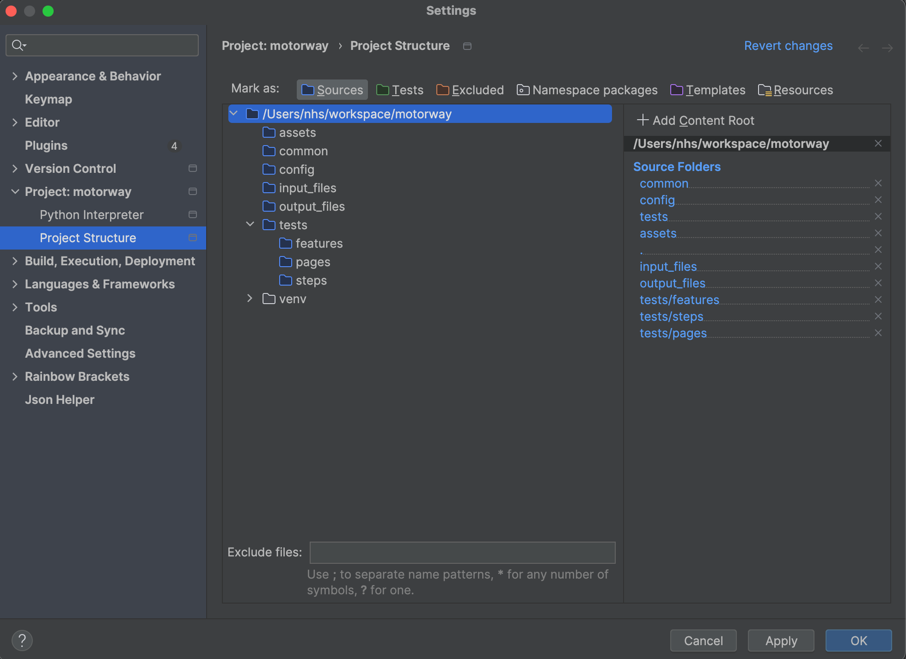
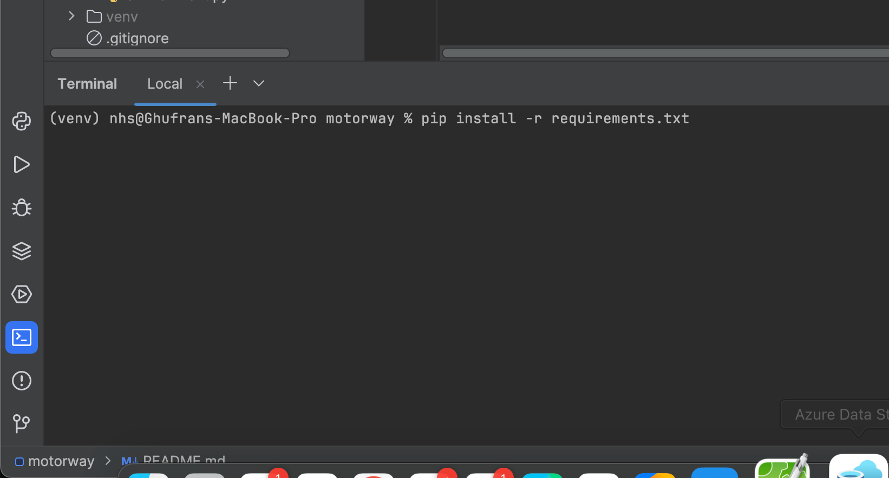

# Motorway Project

## NOTES

1. **Correction in `car_input - V5.txt`**
    - The file initially contained a registration number that appeared to be incorrect: **BM57 BOW**
    - I updated it to **BW57 BOF** to match the registration number and corresponding data in `car_output - V5.txt`

2. **Helper Function for Formatting Registration Numbers**
    - I introduced a helper function named `add_space_after_numbers` (located in `common/common_functions.py`) to ensure
      proper formatting of registration numbers
    - This function adds a space after the two numbers in a registration number (e.g., **KT17DLX** becomes **KT17 DLX**)
    - Without this function, the test fails during assertion because the registration number format does not match the
      data in `car_output - V5.txt`
   
### Prerequisites

To run the tests, ensure the following are installed and configured:

- **Git**: Required for cloning the repo
- **PyCharm**: The IDE I used for running and debugging the tests
- **Python**: Version 3.9 or higher is required

### Cloning the Repository

To get started, clone the repository to your local machine using Git. Run the following command in your terminal or
command prompt:

```
git clone https://github.com/ghufrankhan/motorway.git
```

### Setup

#### Create Virtual Environment

To configure the Python interpreter for the project in PyCharm, follow these steps:

1. Open **PyCharm** and navigate to **Settings**:
    - Go to `File` > `Settings` (or `PyCharm` > `Settings...` on macOS)

2. In the Settings window:
    - Navigate to **Project: motorway** > **Python Interpreter**

3. Add a Local Interpreter:
    - Click on the gear icon next to the interpreter dropdown
    - Select **Add Local Interpreter...**

   

4. Create venv:
    - Location should be `.../motorway/venv`
    - Click **OK** (Ignore error, the venv already exists for me)

   

5. Correct the Project Structure:
    - Navigate to **Project Structure** under **Project: motorway**.
        - Mark required folders as **Sources** (blue folders in the below screenshot)
        - Ensure `venv` is **not** marked as **Excluded**

      

6. Click **Apply** and then **OK**

#### Install requirements.txt to Virtual Environment

To install the required dependencies for the project, follow these steps:

1. Open the **Terminal** in PyCharm:
    - Click the **Terminal** icon at the bottom of the PyCharm window

2. Confirm Virtual Environment status:
    - Ensure the terminal shows the prefix `(venv)` at the beginning of the prompt. This indicates that the virtual
      environment is active

3. Install the dependencies:
    - Run the following command in the terminal:
      ```
      pip install -r requirements.txt
      ```
    - This will install all the packages listed in `requirements.txt`

      

4. Verify the installation:
    - Once the command completes, all required packages will be installed in the virtual environment, and you’re ready
      to run the project.

### Running the Tests
